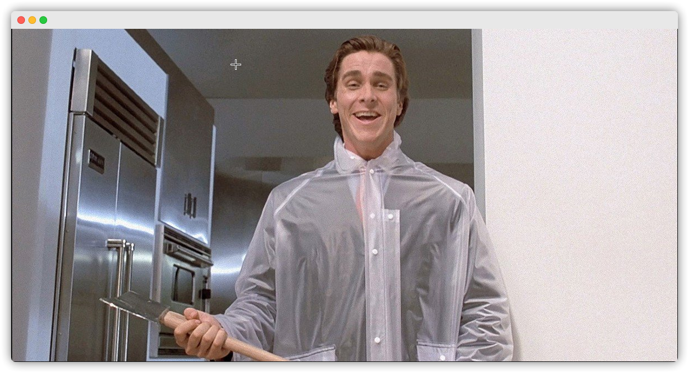

<!-- ABOUT THE PROJECT -->

## About The Project

Inspired by [this](https://twitter.com/breaking_frames) I created a twitter bot that tweets each frame from american psycho. 

* Used FFmpeg to extract each frame from the movie
* Wrote a different Python script to upload each one of the frames to digital ocean spaces
* For each upload I used the digital ocean spaces API to download the image and then upload it to Twitter

I got the whole thing working, however I ran into an issue with twitter post rate limiting, this got my developer account banned from twitter. If I was to do the project again I would be more strict with the rate at which I upload to twitter.